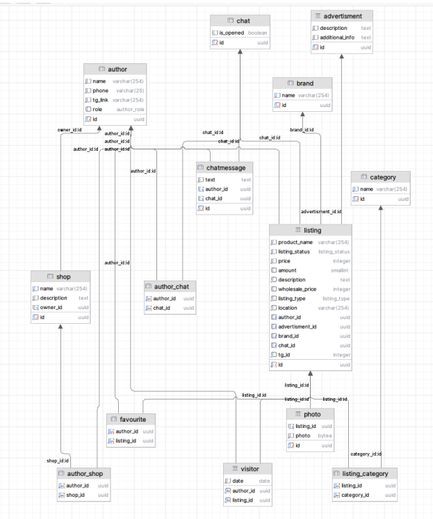

# Реализация базы данных для приложения с объявлениями
- БД PostgreSQL
- Изначально были написаны скрипты миграций, которые автоматически выполняются при запуске Docker контейнера.
- Для тестирования запросов был написан генератор данных, на python с помощью Faker. Также запускаемое из отдельного контейнера.
- Были проанализированы некоторые запросы к бд и были добавлены индексы и разбиения для улучшения производительности запросов.
- Создан скрипт для backup'a существующей базы данных.
- С использованием patroni был сделан отказоустойчивый кластер из 3х контейнеров, обеспечивающий доступ к данным при ошибке в на каком-то из них.
- С помощью Prometheus созданы метрики, позволяющие отслеживать необходимую нам информацию через Grafana.

## БД:

## Что из себя будет представлять само приложение?

### Магазин продажи автозапчастей.
Система каналов в телеграмме (возможно сайт, также открывающийся в
тг), которая позволяет пользователям, или магазинам выставлять свои объявления по продаже
запчастей/авто.

### Функциональные требования:
- Для Пользователя-Владельца Магазина:
  - Возможность добавить/удалить участников в свой магазин
  - Описание
  - Список товаров, возможность редактирования товара
  - Список участников
- Для Пользователя-Продавца:
  - Возможность создать аккаунт (на первом этапе старт бота в тг)
  - Возможность создать Магазин (объединение нескольких пользователей под общим именем). 1
  пользователь может состоять в разных магазинах.
  - Возможность создать объявление (как с личного аккаунта, так и с аккаунта магазина).
  - Возможность создать рекламный пост/ интегрировать рекламу в случайные объявления.
  - Изменение статуса заказа
  - «Поднять свое объявление/ изменить цену» При этом, при изменении только цены, то цена в тг
  канале не обязательно меняется, изменяется только на сайте
  - Оповестить пользователей, которые перешли по объявлению
  Для пользователя-покупателя:
  - Возможность оценить продавца после сделки, оставить отзыв (важно наличие сделки между
  участниками, по инициативе продавца, бот напишет другому пользователю)
  - Добавление объявления в избранное
  - Возможность оставить отзыв о платформе
- Требования к объявлению:
  - Название
  - Цена, за штуку
  - Цена опт при наличии нескольких штук
  - Фото
  - Категория товара
  - Где продается
  - Подкатегория товара
  - Бренд
  - Описание
  - Поле для рекламной вставки
  - Контакты продавца
  - Статус (Продано? Количество товара в наличии? Зарезервировано)
  - Общий чат под объявлением
  - Количество переходов к продавцу по объявлению -> логи переходов
  - Дополнительное поле, появляющееся при конкретном типе объявления
- Требования к общему чату:
  - Возможность его отключить (бот будет удалять все сообщения, но сохранит историю)
  - Управление доступом к удалению сообщений (Настраивается администратором)
- Требования к модератору:
  - Анализ объявления пользователя перед публикацией, редактирование
  - Добавление рекламы в объявление
  - Наблюдение за порядком в общем чате
  - На начальном этапе работы проекта добавлять то, с чем совместима конкретная запчасть
- Требования к администратору:
  - Назначение модераторов
  - Блокировка пользователей
  - Все права модератора
  - Все права пользователя
- Типы объявлений:
  - Объявление для продажи машин.
  - Объявление для продажи запчастей.
  - Объявление об услугах изготовления запчастей на заказ

